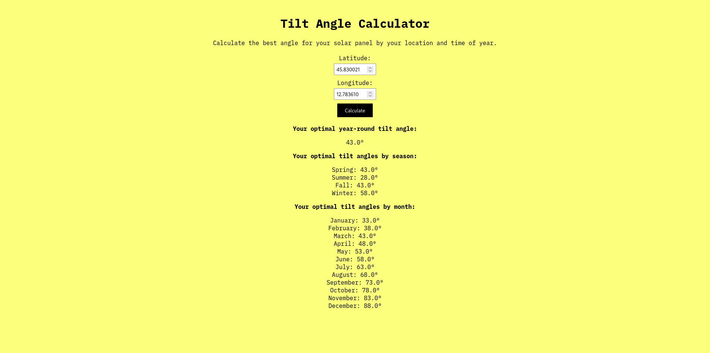

# Solar Panel Tilt Angle Online Website Calculator 



## Overview

This repository contains a web application designed to calculate the optimal tilt angle for your solar panel based on your location (latitude and longitude) and time of year. Built with HTML, CSS, and JavaScript, it provides a user-friendly interface for calculating year-round, seasonal, and monthly tilt angles. This open-source project can be easily adapted for other similar applications.

### Features

- **Optimal Tilt Angle Calculation:** Users can input their latitude and longitude to calculate the optimal tilt angle for their solar panel.
- **Seasonal and Monthly Angles:** The tool provides tilt angle recommendations for each season and month.
- **Responsive Design:** The application is designed to be responsive and user-friendly across different devices.

## Installation

To set up and run this project locally, follow these steps:

### Prerequisites

- Web browser

### Clone the Repository

```bash
git clone https://github.com/yourusername/solar-panel-tilt-angle-calculator.git
cd solar-panel-tilt-angle-calculator
```

## Contributing

Contributions to this project are welcome! Here's how you can contribute:

1. Fork the repository.
2. Create a new branch (`git checkout -b feature-branch`).
3. Make your changes and commit them (`git commit -am 'Add some feature'`).
4. Push to the branch (`git push origin feature-branch`).
5. Create a new Pull Request.

Please make sure to update tests as appropriate and adhere to the existing coding standards.

## License

This project is licensed under the MIT License - see the LICENSE file for details.
